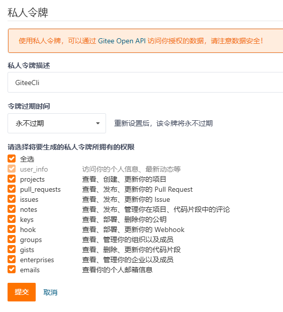

# GiteeCli

## 使用前准备

### 1.申请Gitee API Token

登录Gitee，在 设置--> 安全设置-->私人令牌 中生成新令牌





### 2.生成SSH Key

在电脑上生成SSH Key 并填入 设置-->安全设置-->公钥部分。参照：[公钥设置](https://help.gitee.com/base/account/SSH%E5%85%AC%E9%92%A5%E8%AE%BE%E7%BD%AE)

### 3.安装.NET 9 SDK

下载 SDK 并安装，[下载地址](https://dotnet.microsoft.com/zh-cn/download/dotnet/9.0)

### 4.安装 GiteeCli 工具

打开终端，执行

```bash
dotnet tool install --global gitee-cli
```

查看使用帮助：

```bash
gitee-cli -h
gitee-cli clone -h
```


## 命令介绍

### 设置 Token

##### 通过命令行设置

设置第一步生成的私人令牌，在终端中执行：

```bash
gitee-cli set token 0c47b5a462c43765bc33a14ec7169
```

获取Token：

```bash
gitee-cli get token
```

##### 通过环境变量设置

在系统上添加环境变量 GITEE_TOKEN = 0c47b5a462c43765bc33a14ec7169

### 列出所有仓库

在终端执行：

```bash
gitee-cli list
```

### 克隆仓库

在终端执行以下命令，其中 `<repo_name>` 是 `gitee-cli list` 命令输出的仓库名称

```bash
gitee-cli clone --name <repo_name>
```

执行命令，仓库克隆到当前目录。

**克隆所有仓库，执行：**

```bash
gitee-cli clone
```

### 删除仓库

从 gitee.com 删除一个仓库，执行：

```bash
gitee-cli delete <repo_name>
```

### 列出 Star 仓库

终端执行：

```bash
gitee-cli star
```

### 列出用户的代码片段

终端执行：

```bash
gitee-cli gists list
```

列出代码片段的ID ，描述，文件名。

### 创建代码片段

将本地文件作为代码片段上传，只支持文本文件。在文件目录下打开终端执行：

```bash
gitee-cli gists create --title 一条笔记 --file note.txt
```

### 下载代码片段

终端执行：

```bash
gitee-cli gists download --id z6datuobxwj4lm18ncv2e75
```

会下载 `note.txt` 到本地。

### 更新代码片段

修改下载的代码片段文件 `note.txt`，然后执行更新命令：

```bash
gitee-cli gists update --id z6datuobxwj4lm18ncv2e75 --title 一条笔记update --file note.txt
```

### 删除代码片段

终端执行：

```bash
gitee-cli gists delete --id z6datuobxwj4lm18ncv2e75
```

